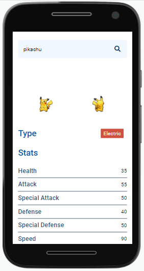

# PokéFacts

PokéFacts é uma plataforma que consome os dados da API [PokéApi](https://pokeapi.co/about) para disponibilizar informações(como habilidades, ataques, localizações, entre outras) de mais de 1118 Pokémons.

### Visão Geral

#### O desafio

O usuário pode:

- Ver o layout do aplicativo independente do tamanho da tela (Design Responsivo);
- Procurar qualquer Pokémon dentre os disponíveis da API;
- Ler informações sobre o Pokémon pesquisado.

#### Screenshot

#### Links

- Live Site URL: [Github Pages](https://oliverids.github.io/pokefacts/)

## Processo

#### Feito com

- HTML5 semântico
- Propriedades CSS customizadas
- Flexbox
- SASS Compiler
- Mobile-first Workflow
- JavaScript Síncrono e Assíncrono